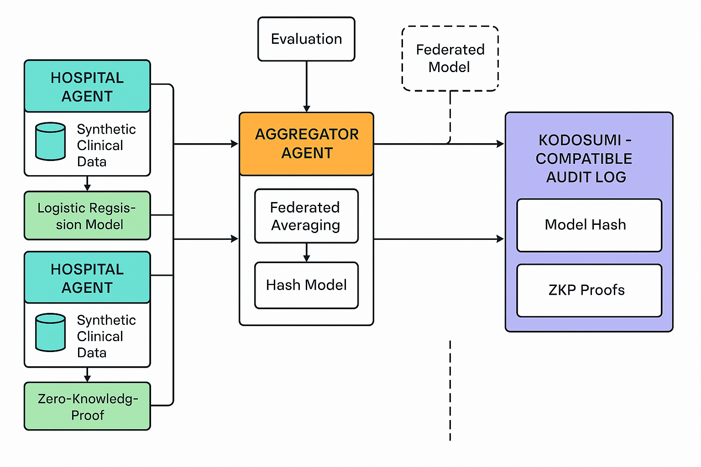
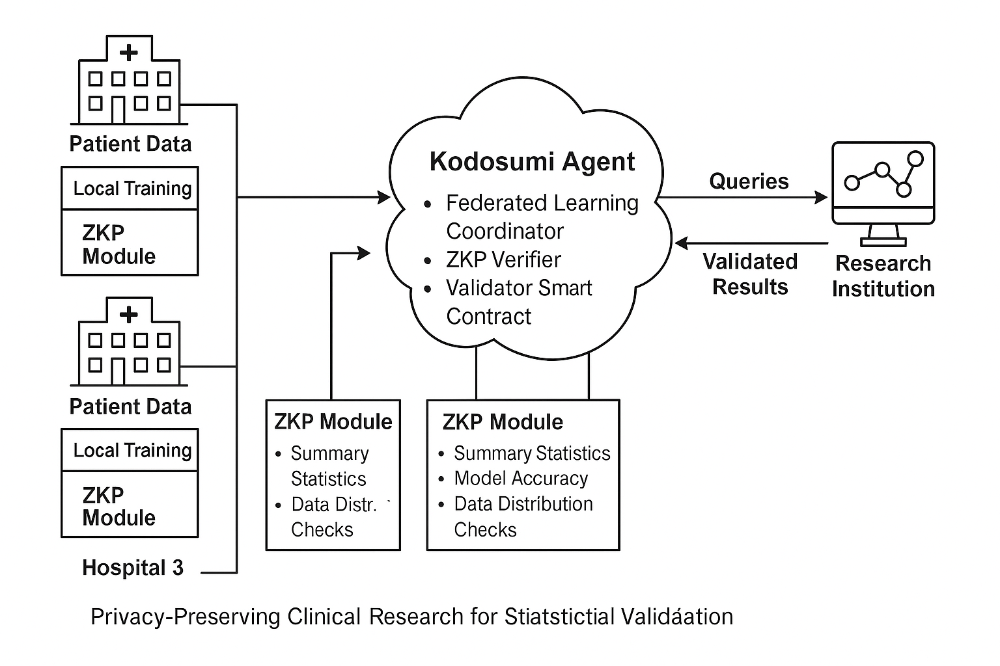

# clinical research agent for statistical validation, and federated learning, ZKPs Masumi-Kodosumi framework

## Overview
This project implements a privacy-preserving clinical research backend system using:
- **Zero-Knowledge Proofs** (via ZoKrates circuits)
- **Crew AI agents** for task orchestration
- **Masumi Network** for secure communication and computation
- **kodosumi ** for efefctive agent handling

## Structure
- `agents/`: Crew AI agents handling coordination, computation, and validation.
- `zk_circuits/`: Zero-Knowledge Proof circuits and handlers.
- `masumi_integration/`: Communication with the Masumi Network.
- "federated-kodosumi/":   agent traceability and verification

## How to Use
1. Setup ZoKrates and compile circuits.
2. Deploy agents and orchestrate tasks using Crew AI.
3. Submit tasks through Masumi Network.
4. Verify ZK proofs without revealing private data.

## Requirements
- Python 3.10+
- crewAI
- ZoKrates
- requests

## License

This project is licensed under the MIT License - see the [LICENSE](LICENSE) file for details.
